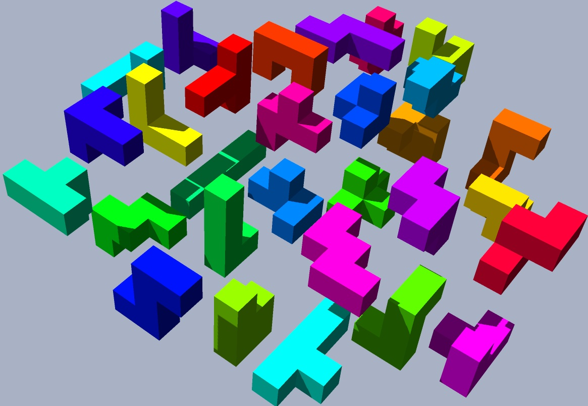
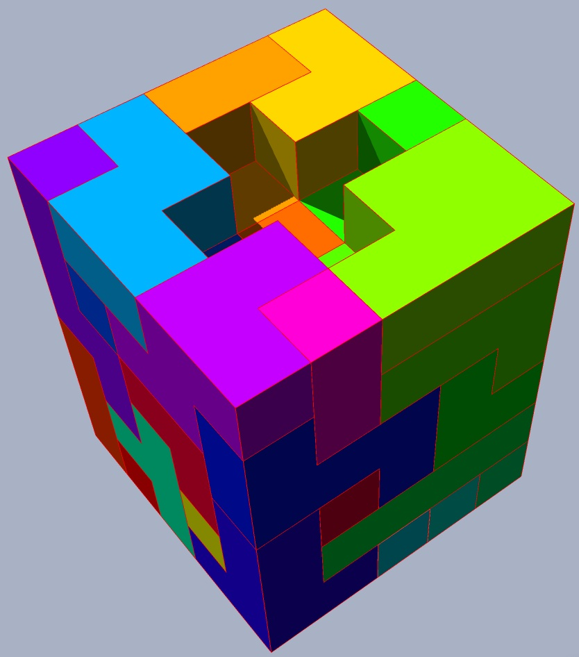

## or-tools: Examples and Models

### Seating - A Delegate Seating Problem
_This is the problem that introduced me to **or-tools**._

This is the sort of problem that I consider to be verging on requiring access to magic.

There is a one day event that covers several named sessions.
The seating for the event does not change: seats are arranged in named rows of different lengths. 

Company (organisation) delegates should always sit together, and a delegate should not have to switch seats if attending successive sessions.

What makes this more complex than e.g. a wedding planner is that delegates do not go to all sessions.

So, the constraints are:
* Seating is in rows. Each row has an arbitrary number of seats. 
* Each named delegate belongs to one named organisation.
* Each delegate will attend at least one session.
* Delegates of each organisation sit in adjacent seats in a session.
* Each delegate will sit in the same place in consecutive sessions.
* Each seat can only sit one delegate per session.
* Each delegate is assigned a maximum of one chair in each session.

### Chessboard - legal pieces puzzle
Given a library of pieces and their moves, 
and given a requirement of which pieces to use, and how many,
determine a solution such that no piece can be taken by another.

This is an extension of the N-Queens puzzle
E.g. find a solution for 6 queens, 2 knights, and maximum (2) kings.


     ♞■□■□■□♚
     ■□■♛■□■□
     □■□■□■♛■
     ■□♛□■□■□
     □■□■□♛□■
     ■♛■□■□■□
     □■□■♛■□■
     ♚□■□■□■♞

### Polyomino Puzzle Solver
This solves filling a space with a set of defined polyominoes.

_A polyomino is a plane geometric figure formed by joining one or more equal squares edge to edge.
It is a polyform whose cells are squares. It may be regarded as a finite subset of the regular square tiling._

This example includes a pentomino class.

A standard pentomino puzzle is to tile a rectangular box with the pentominoes, i.e. cover it without overlap and
without gaps. Each of the 12 pentominoes has an area of 5 unit squares, so the box must have an area of 60 units.
Possible sizes that use just one of each pentomino are 6×10, 5×12, 4×15 and 3×20.
The 6×10 case, first solved in 1960, has exactly 2339 solutions.
The 5×12 box has 1010 solutions, the 4×15 box has 368 solutions, and the 3×20 box has just 2 solutions
The 8×8 rectangle with a 2×2 hole in the center has 65 solutions.

This program allows any grid (with arbitrary holes) and allows a variety of shapes to be used to fill it.
e.g. 10x12 grid, with 8 x 'U' pentominoes and 1 or more 'F'.
If successful, it returns a box drawing of the result, e.g. for a 3x20 grid with 1 of each pentomino:

    ╔═══╦═╦═════╦═══════╦═╦═════╦═══╦═╦═════╗
    ║ ╔═╝ ╚═╗   ║ ╔═══╦═╝ ╚═╗ ╔═╝ ╔═╣ ╚═══╗ ║
    ║ ╚═╗ ╔═╩═══╩═╩═╗ ╚═══╗ ║ ║ ╔═╝ ╚═══╗ ║ ║
    ╚═══╩═╩═════════╩═════╩═╩═╩═╩═══════╩═╩═╝

### Polycube Puzzle Solver
This solves filling a 3D space with a set of defined polycubes.
It is roughly the same as the polyomino solver, but extended to three dimensions.

A pentacube is a polycube composed of 5 cubes.
There are 29 distinct three-dimensional pentacubes (Bouwkamp 1981).
Of these, the 12 planar pentacubes (corresponding to solid pentominoes), are well known.
Among the non-planar pentacubes, there are five that have at least one plane of symmetry;
Each of them is its own mirror image. The remaining 12 pentacubes come in mirror image pairs.

This will generate obj/mtl 3D 'Wavefront' files of the solution.






#### Digraph Solver
This uses just one single constraint! AddCircuit()

An or-tools example implementing/demonstrating the AddCircuit constraint
Find path from 'start' to 'stop' through a directed graph (digraph) of nodes and arcs in a given number of steps.
steps can be a specific number, 'min', or 'max'

The problem codes the digraph as a dict of nodes : a list of the arcs from that node.
For instance,

```Python
a: ['o', 'd', 'b', 'y']  # node 'a' has 4 outgoing arcs:  a->o, a->d, a->b, a->y
```

This example:
* Generates a random problem with 61 nodes, all but the 'stop' node having 4 outgoing arcs.
* Prints the problem digraph
* Solves the minimum and maximum paths.
* Solves (or fails) for seeking path-lengths from minimum to maximum steps long printing the result.

For instance, using 26 nodes it may produce something like the following:

````text
a: ['g', 't', 'n', 'w']
b: ['p', 'g', 'l', 'n']
c: ['i', 'z', 'o', 'k']
d: ['y', 'x', 'p', 'z']
e: ['u', 'f', 'h', 'j']
f: ['n', 'q', 'l', 'j']
g: ['r', 'q', 'u', 'b']
h: ['m', 'v', 's', 'w']
i: ['p', 'w', 'q', 'v']
j: ['g', 'f', 'e', 'q']
k: ['n', 'p', 's', 'c']
l: ['q', 'n', 'u', 't']
m: ['d', 'k', 'x', 'r']
n: ['u', 'l', 'q', 's']
o: ['z', 'y', 'm', 'h']
p: ['o', 'x', 'l', 'j']
q: ['k', 'g', 'm', 'c']
r: ['n', 'h', 'k', 'j']
s: ['p', 'm', 'k', 'h']
t: ['k', 'u', 'i', 'c']
u: ['b', 's', 'w', 'd']
v: ['o', 'b', 'd', 'p']
w: ['l', 'o', 'f', 'e']
x: ['r', 'j', 'w', 'e']
y: ['p', 'x', 'h', 'g']
z: []

a-w-o-z
a-g-q-c-z
a-w-l-t-c-z
a-g-b-l-q-c-z
a-g-b-p-o-m-d-z
a-w-o-y-p-l-u-d-z
a-g-b-p-j-e-h-m-d-z
a-g-b-p-j-e-h-m-k-c-z
a-g-b-p-j-e-h-m-k-c-o-z
a-t-u-d-y-g-b-l-n-s-k-c-z
a-w-l-t-c-o-y-p-x-r-n-u-d-z
a-t-u-s-h-v-p-l-n-q-c-i-w-o-z
a-w-l-t-u-s-p-o-y-x-r-n-q-m-d-z
a-g-r-h-v-p-l-t-u-b-n-q-c-i-w-o-z
a-g-r-k-n-q-c-i-w-o-h-v-p-l-t-u-d-z
a-g-r-j-e-h-v-p-l-t-u-b-n-q-c-i-w-o-z
a-g-r-j-e-h-v-p-l-t-u-s-k-n-q-c-i-w-o-z
a-t-k-c-i-w-f-q-m-d-x-j-g-u-b-l-n-s-p-o-z
a-n-s-m-x-r-j-e-f-q-k-c-i-w-l-t-u-d-y-p-o-z
a-w-f-q-m-d-x-j-e-u-b-g-r-k-n-l-t-c-i-v-p-o-z
a-w-l-t-i-v-b-n-s-k-c-o-y-p-x-r-j-e-f-q-g-u-d-z
a-g-u-d-y-p-j-e-f-q-m-x-r-n-s-h-w-l-t-k-c-i-v-o-z
a-w-l-t-u-b-g-q-k-c-i-v-o-y-p-x-r-j-e-f-n-s-h-m-d-z
````

#### That's all for the moment!

